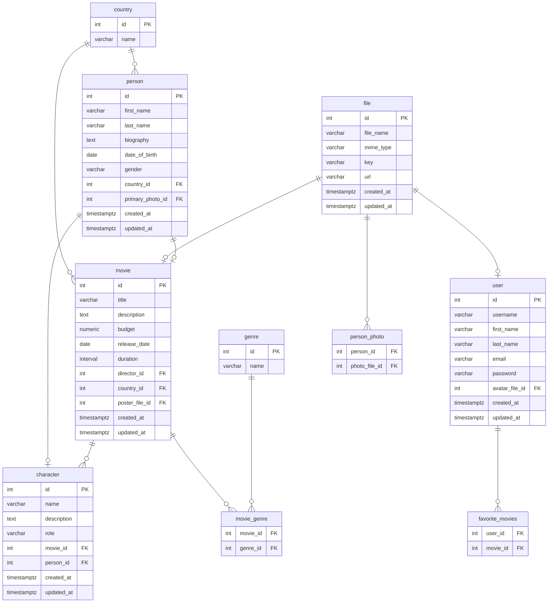

# bsa-db-sql
ER Diagram

```mermaid
erDiagram
    country {
        int id PK
        varchar name
    }

    file {
        int id PK
        varchar file_name
        varchar mime_type
        varchar key
        varchar url
        timestamptz created_at
        timestamptz updated_at
    }

    "user" {
        int id PK
        varchar username
        varchar first_name
        varchar last_name
        varchar email
        varchar password
        int avatar_file_id FK
        timestamptz created_at
        timestamptz updated_at
    }

    person {
        int id PK
        varchar first_name
        varchar last_name
        text biography
        date date_of_birth
        varchar gender
        int country_id FK
        int primary_photo_id FK
        timestamptz created_at
        timestamptz updated_at
    }

    movie {
        int id PK
        varchar title
        text description
        numeric budget
        date release_date
        interval duration
        int director_id FK
        int country_id FK
        int poster_file_id FK
        timestamptz created_at
        timestamptz updated_at
    }

    genre {
        int id PK
        varchar name
    }

    movie_genre {
        int movie_id FK
        int genre_id FK
    }

    "character" {
        int id PK
        varchar name
        text description
        varchar role
        int movie_id FK
        int person_id FK
        timestamptz created_at
        timestamptz updated_at
    }

    person_photo {
        int person_id FK
        int photo_file_id FK
    }

    favorite_movies {
        int user_id FK
        int movie_id FK
    }

    country ||--o{ person: ""
    country ||--o{ movie: ""
    file ||--o| "user": ""
    file ||--o{ person_photo: ""
    file ||--o| movie: ""
    "user" ||--o{ favorite_movies: ""
    person ||--o| movie: ""
    person ||--o| "character": ""
    movie ||--o{ "character": ""
    movie ||--o{ movie_genre: ""
    genre ||--o{ movie_genre: ""

```
