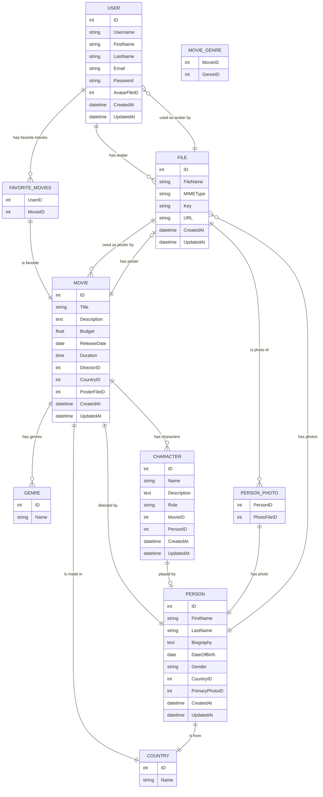

# bsa-db-sql

```mermaid
erDiagram
    USER {
        int ID
        string Username
        string FirstName
        string LastName
        string Email
        string Password
        int AvatarFileID
        datetime CreatedAt
        datetime UpdatedAt
    }
    FILE {
        int ID
        string FileName
        string MIMEType
        string Key
        string URL
        datetime CreatedAt
        datetime UpdatedAt
    }
    MOVIE {
        int ID
        string Title
        text Description
        float Budget
        date ReleaseDate
        time Duration
        int DirectorID
        int CountryID
        int PosterFileID
        datetime CreatedAt
        datetime UpdatedAt
    }
    GENRE {
        int ID
        string Name
    }
    MOVIE_GENRE {
        int MovieID
        int GenreID
    }
    CHARACTER {
        int ID
        string Name
        text Description
        string Role
        int MovieID
        int PersonID
        datetime CreatedAt
        datetime UpdatedAt
    }
    PERSON {
        int ID
        string FirstName
        string LastName
        text Biography
        date DateOfBirth
        string Gender
        int CountryID
        int PrimaryPhotoID
        datetime CreatedAt
        datetime UpdatedAt
    }
    PERSON_PHOTO {
        int PersonID
        int PhotoFileID
    }
    FAVORITE_MOVIES {
        int UserID
        int MovieID
    }
    COUNTRY {
        int ID
        string Name
    }
    USER ||--o{ FILE : "has avatar"
    MOVIE ||--o| FILE : "has poster"
    MOVIE ||--|| COUNTRY : "is made in"
    MOVIE ||--|| PERSON : "directed by"
    MOVIE ||--o{ GENRE : "has genres"
    MOVIE ||--o{ CHARACTER : "has characters"
    CHARACTER ||--o| PERSON : "played by"
    PERSON ||--o{ FILE : "has photos"
    USER ||--o{ FAVORITE_MOVIES : "has favorite movies"
    FAVORITE_MOVIES ||--|| MOVIE : "is favorite"
    FILE ||--o{ USER : "used as avatar by"
    FILE ||--o{ MOVIE : "used as poster by"
    FILE ||--o{ PERSON_PHOTO : "is photo of"
    PERSON_PHOTO ||--|| PERSON : "has photo"
    PERSON ||--|| COUNTRY : "is from"

```
